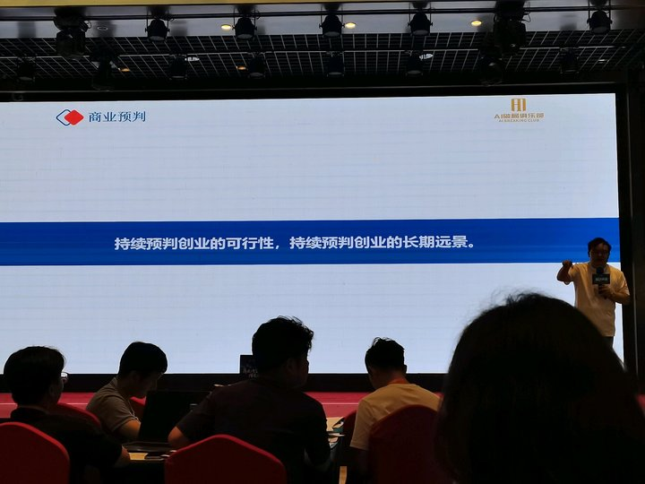
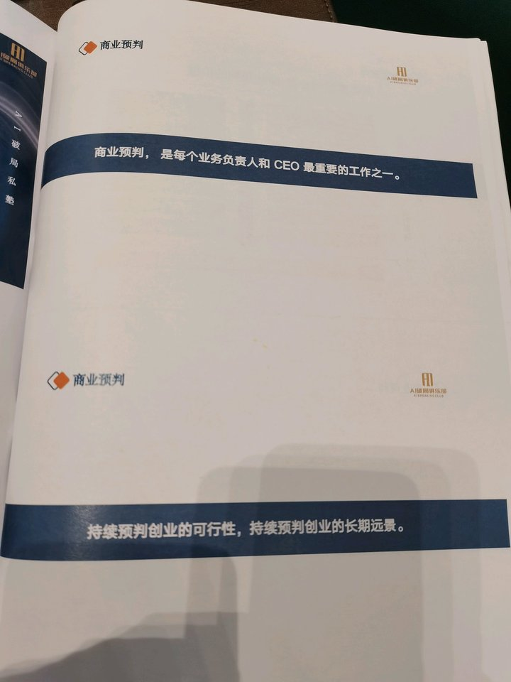
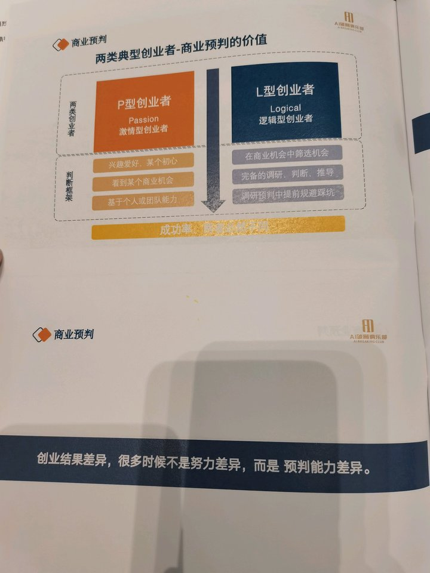
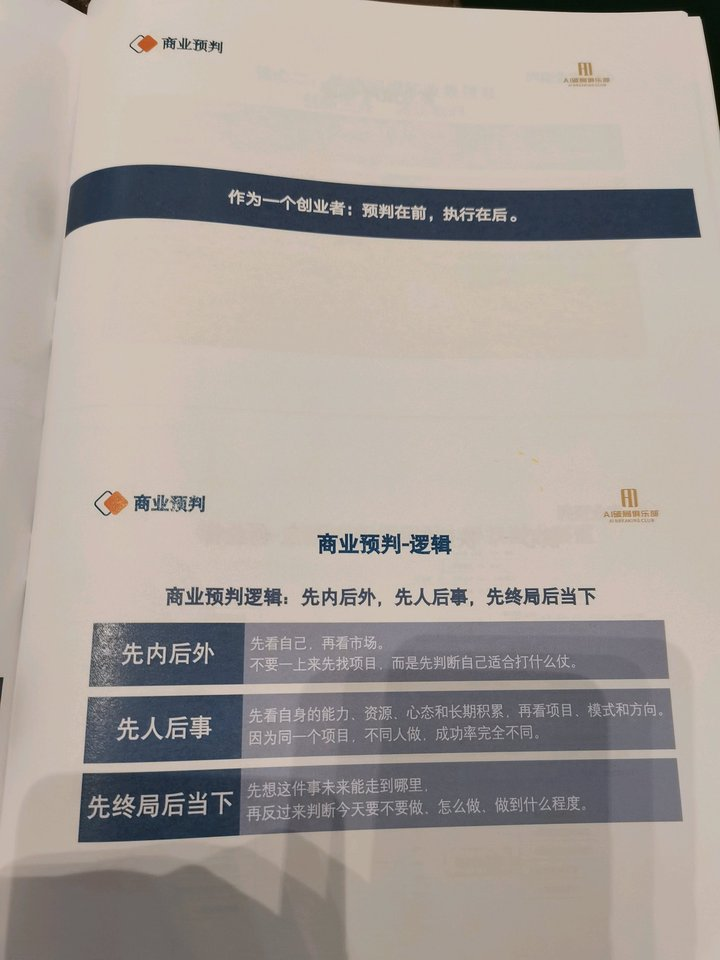
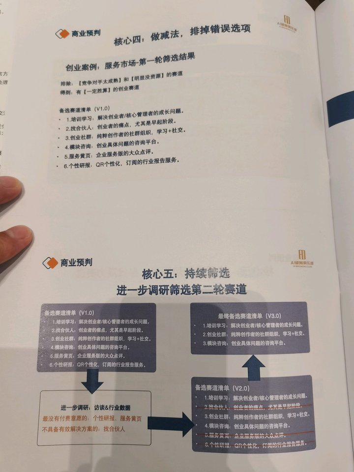
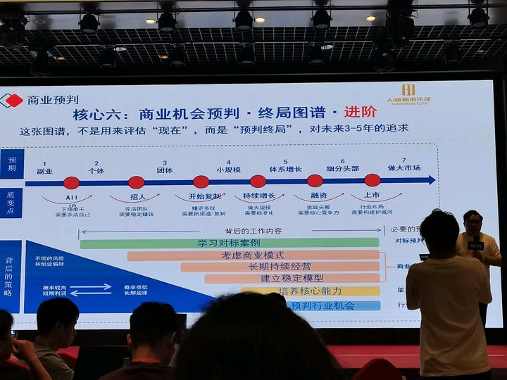

# 商业预判方法论与 AI 时代创业逻辑分享 · 术法道器势拆解

> 这篇讲的不是“如何找到一个项目”，而是“如何在行动之前把胜率、边界和终局先算清楚”。它是前一篇商业心法之后更具体的一层：把创业从激情驱动，拉回到预判驱动。

## 0. 素材边界

- 来源：妙记分享页、智能总结、文字记录、6 张课堂图片。
- 课程时间：2026-06-12 10:30:57。
- 主题：商业预判、创业者类型、赛道筛选、终局图谱、AI 时代培训行业变化。
- 可靠性说明：课堂数字如 ROI、KOL 分润、增长速度等属于讲者现场口径；本文只做课程内逻辑拆解，未做外部独立核验。

## 1. 如果只读 10 分钟

1. 这节课的核心是：创业成功差异，很多时候不是努力差异，而是预判能力差异。
2. 讲者把创业者分成 P 型和 L 型：P 型靠激情、兴趣、机会感；L 型靠机会筛选、调研推导、风险规避。
3. 商业预判的底层顺序是：先内后外、先人后事、先终局后当下。
4. 好机会不是市场上存在就属于你，必须和你的能力、资源、心态、长期积累匹配。
5. “养猪还是养孩子”是判断终局的比喻：只为短期套利是养猪，能接近长期目标才值得当长期事业养。
6. 五步方法论是：快速扫描信息、创新业务调研、需求拆解匹配、做减法排除、终局图谱判断。
7. 对标不是抄袭，所有创新本质都是对已有商业元素的重新组合，没有对标就很难创新。
8. AI 时代纯技能培训会被压缩，培训要转向商业逻辑、线下链接和情绪价值。
9. 预判不是慢吞吞做报告，而是在行动前把“我是谁、机会是什么、终局在哪、风险怎么排除”先算清楚。
10. 最值得带走的动作：给自己的项目画一张“收益/风险/终局”分析表，再决定是做大、做小、做快钱，还是放弃。

## 2. 术法道器势总表

| 层 | 本课拆出来的核心 | 可执行落点 |
|---|---|---|
| 术 | 潜伏调研、购买竞品、问 ROI、访谈用户、列备选赛道、排除错误选项、画收益风险表 | 本周选一个项目，列出 10 个对标、5 个用户访谈对象、3 个备选赛道，先做排除而不是立刻开干 |
| 法 | 商业预判五步法；先内后外、先人后事、先终局后当下；终局图谱七阶段 | 用一张表回答：我适合什么、用户痛什么、已有方案差在哪、我的更优方案是什么、3-5 年能到哪一层 |
| 道 | 创业不是证明自己行，而是持续用数据、用户、对标来校验自己可能错在哪里 | 每个判断前加一句“证据是什么”；没有证据的判断默认降级为假设 |
| 器 | 行业研报、投融资数据库、竞品课程/社群、用户访谈表、赛道评分表、终局图谱、AI 辅助调研 | 固定一个“预判工具箱”：信息源、访谈问题、评分维度、财务测算、风险清单 |
| 势 | AI 重构技能供给，纯技能培训下行；链接、人脉、IP、商业判断和高维交付变稀缺 | 不要只做工具教程，要把业务转向“技能 + 场景 + 商业结果 + 资源链接” |

## 3. 原课结构拆解

### 3.1 两类创业者：激情不是战略

P 型创业者的问题不是没热情，而是把热情当成了判断依据。看到机会、喜欢方向、觉得自己能做，然后直接下场。这类人启动快，但因为没有完整调研和终局推演，踩坑概率高。

L 型创业者先做筛选，再做判断。讲者用 AI 破局俱乐部举例：先潜伏头部 AI 社群和课程，测算 ROI，再判断是否能用分润机制撬动 KOL 推广，最后设计三步战略。这不是“看到风口就冲”，而是先把增长机制算出来。

关键不是“做事快不快”，而是“快之前有没有想清楚”。预判完成后可以很快，没有预判的快只是赌。

### 3.2 三条底层逻辑：先看自己，再看市场

第一，先内后外。很多人先问“现在什么项目火”，但真正的问题是“我适合打什么仗”。AI 社群机会出现时，不是所有人都能做，讲者能做，是因为之前有 IP、科技创业标签、KOL 连接和社群理解。

第二，先人后事。同一个项目，不同人做，天花板完全不同。项目不是独立存在的，它和创始人的能力、资源、心态、长期积累绑定。

第三，先终局后当下。要先判断这件事最终可能长成什么，再决定今天要不要做、怎么做、做到什么程度。

### 3.3 五步方法论：从信息到终局

五步可以拆成一个创业决策漏斗：

1. 快速扫描和收集信息：行业、用户、模式、案例、投融资、对标。
2. 创新业务调研：用户痛点、能力、状态；现有方案缺陷；你的更优方案。
3. 按需求拆解匹配：按场景、需求、服务方向拆出潜力赛道。
4. 做减法：排除成熟度过高、资源不匹配、付费意愿低、无有效解决方案的方向。
5. 终局图谱：判断未来 3-5 年能走到哪个阶段。

### 3.4 终局图谱：不是评估现在，是预判未来

终局图谱把商业分成七层：副业、个体、团体、小规模、体系增长、细分头部、做大市场。它的价值不是让你幻想上市，而是让你知道自己现在到底在打哪一层的仗。

如果你的项目只适合副业，就不要用体系化公司的成本结构去做。如果你想冲细分头部，就不能只靠创始人个人技能和情绪驱动。

## 4. 深挖：这节课真正有价值的 8 个点

### 4.1 预判不是预测运气，是提升决策胜率

商业预判不要求你算准未来，而是要求你把明显错误的选择排除掉。它更像风控系统：先降低败率，再提高胜率。

### 4.2 “我觉得行”是创业早期最危险的信号

讲者反复强调要用数据、用户、对标、拆解来 check 自己。这里的重点不是否定直觉，而是直觉只能提出假设，不能直接当结论。

### 4.3 先找大哥，不如先包装自己

课程里“找大哥”的本质是资源吸附能力。你不能只想认识更强的人，要先让对方看到你的价值、可信度和可合作空间。IP、作品、案例、观点，都是让资源愿意靠近你的包装。

### 4.4 Plan B 和 Plan C 是预判能力的一部分

只留一个方向，很容易把自己绑死。真正的预判不是选一个答案，而是保留几个高胜率备选，再用验证不断收窄。

### 4.5 对标是创新的前提

没有对标，往往不是你在做全新生意，而是你还没做够调研。创新不是凭空发明，而是把成熟元素重新组合到新的用户、场景、渠道或交付结构里。

### 4.6 AI 对行业的影响要提前算进终局

讲者判断纯技能培训会被 AI 压缩，这个判断不一定要逐字照收，但思路是对的：今天做业务，必须问“如果 AI 把这个能力免费化，我还剩什么价值？”

### 4.7 线下链接和情绪价值不是补充项，可能会变成主价值

当信息和技能供给越来越便宜，用户买的不只是内容，而是陪伴、监督、同侪、资源、身份和机会。

### 4.8 商业预判是 CEO 工作，不是咨询报告

预判不是一年做一次战略会，而是每个关键动作前都要做：进不进赛道、做哪个产品、找什么人、投什么渠道、是否扩张。

## 5. 我补充的内容

下面是基于原课补出来的落地工具，不是讲者逐字表达。

### 5.1 补一张“商业预判一页纸”

| 模块 | 要回答的问题 |
|---|---|
| 我是谁 | 我的能力、资源、信用、渠道、长期积累是什么 |
| 用户是谁 | 哪类人在什么场景下痛到愿意付费 |
| 对标是谁 | 头部、腰部、小而美玩家分别是谁，收入模式是什么 |
| 机会是什么 | 外部趋势、AI 变化、政策、平台、资本、消费心理带来什么窗口 |
| 劣势是什么 | 我缺什么，行业共性问题是什么，哪些问题会杀死项目 |
| 更优方案 | 我比现有方案好在哪里，是更快、更便宜、更可信，还是更能拿结果 |
| 验证动作 | 最低成本怎么验证：访谈、预售、海报、社群、小样本交付 |
| 终局判断 | 这是副业、个体项目、团队业务、体系增长，还是细分头部机会 |

### 5.2 补一张“养猪/养孩子判断表”

| 判断项 | 养猪型项目 | 养孩子型项目 |
|---|---|---|
| 时间周期 | 3-12 个月套利 | 3-5 年持续经营 |
| 能力沉淀 | 做完不一定增强核心能力 | 每做一次都增强组织、IP、产品或渠道 |
| 信任资产 | 只消耗流量 | 持续积累案例和口碑 |
| 终局关系 | 和长期目标弱相关 | 和长期目标强相关 |
| 退出方式 | 赚完就走，或卖掉 | 不断迭代，长期复利 |

### 5.3 补一张“AI 时代行业预判四问”

1. AI 会不会把我的核心交付成本打到接近 0？
2. 如果技能不值钱，用户还愿意为什么付费？
3. 我是否拥有 AI 难以替代的信任、资源、场景、组织或审美判断？
4. 这个业务未来 3 年应该从“卖技能”转向“卖结果、链接、陪跑、系统”中的哪一个？

## 6. 课后作业

用自己的项目做一次完整预判：

1. 列出 10 个对标玩家，记录价格、产品形态、流量渠道、用户反馈。
2. 访谈 5 个真实用户，问痛点、替代方案、预算、决策阻碍。
3. 做一张 SWOT 表，只写事实，不写口号。
4. 画一张终局图谱，判断你要打到哪一层。
5. 写出 3 个排除理由：哪些方向看起来诱人，但不适合你。
6. 最后只留下一个主方向和两个备选方向。
